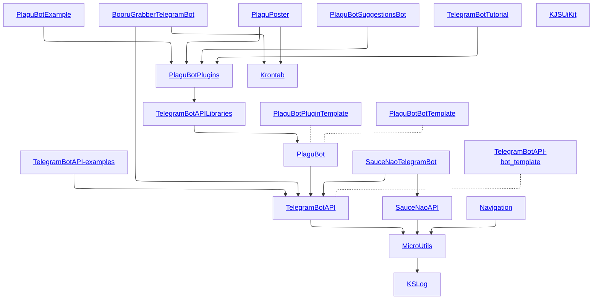

# Insanus Mokrassar libraries home

Hello :) It is my libraries docs place and I glad to welcome you here. I hope, this documentation place will help you.

## Projects

| Common and independent | TelegramBotAPI | Plagubot |
| :--- | :---: | ---: |
|  |  |  |
|  |  |  |
|  | | |
|  | | |
|  | | |
|  | | |

## Dependencies graph:

