# MicroUtils

`MicroUtils` is a set of libraries to help me (and, I hope, you too) in some routine doings of coding.

First of all, this library collection is oriented to use next technologies:

* [`Kotlin Coroutines`](https://github.com/Kotlin/kotlinx.coroutines)
* [`Kotlin Serialization`](https://github.com/Kotlin/kotlinx.serialization)
* [`Kotlin Exposed`](https://github.com/JetBrains/Exposed)
* [`Ktor`](https://ktor.io)
* [`Koin`](https://insert-koin.io)
* [`Korlibs`](https://docs.korge.org)

> WARNING:
> 
> Due to complexity of this library, it is possible that some things will be missed or inactual.
> Me and the users of this library will try hard to keep its docs as actual as possible, but in case
> you will find some inconsistency of docs and library work (signatures, behaviour, API) you may write
> me directly in my [telegram](https://t.me/InsanusMokrassar)

```mermaid
flowchart LR
%% Project Build & Infrastructure
    subgraph "Project Build & Infrastructure"
        gradleWrapper("Gradle Wrapper & Plugins"):::buildInfra
        CI("CI Workflows"):::buildInfra
        templates("Gradle Templates"):::buildInfra
    end

    %% Core Utility Layer
    subgraph "Core Utility Layer"
        common("common"):::core
        colors("colors"):::core
        safe_wrapper("safe_wrapper"):::core
        resources("resources"):::core
    end

    %% Feature-Specific Modules
    subgraph "Feature-Specific Modules"
        crypto("crypto"):::feature
        mime_types("mime_types"):::feature
        language_codes("language_codes"):::feature
        matrix("matrix"):::feature
        selector("selector"):::feature
        transactions("transactions"):::feature
    end

    %% Asynchronous Helpers
    subgraph "Asynchronous Helpers"
        coroutines("coroutines"):::async
        compose("coroutines/compose"):::async
    end

    %% Serialization Helpers
    subgraph "Serialization Helpers"
        base64("serialization/base64"):::serialization
        encapsulator("serialization/encapsulator"):::serialization
        mapper("serialization/mapper"):::serialization
        typed_serializer("serialization/typed_serializer"):::serialization
    end

    %% Repository Abstractions
    subgraph "Repository Abstractions"
        repos_common("repos/common (API)"):::repos
        repos_inmemory("repos/inmemory"):::repos
        repos_cache("repos/cache"):::repos
        repos_exposed("repos/exposed"):::repos
        repos_ktor_client("repos/ktor/client"):::repos
        repos_ktor_common("repos/ktor/common"):::repos
        repos_ktor_server("repos/ktor/server"):::repos
    end

    %% Ktor Extensions
    subgraph "Ktor Extensions"
        ktor_common("ktor/common"):::ktor
        ktor_client("ktor/client"):::ktor
        ktor_server("ktor/server"):::ktor
    end

    %% Dependency Injection (Koin)
    subgraph "Dependency Injection (Koin)"
        koin_api("koin/src"):::di
        koin_generator("koin/generator"):::di
    end

    %% KSP Code-Generation Modules
    subgraph "KSP Code-Generation Modules"
        ksp_classcasts("ksp/classcasts"):::ksp
        ksp_sealed("ksp/sealed"):::ksp
        ksp_variations("ksp/variations"):::ksp
        ksp_generator("ksp/generator"):::ksp
    end

    %% Android UI Wrappers
    subgraph "Android UI Wrappers"
        alerts("android/alerts"):::android
        pickers("android/pickers"):::android
        recyclerview("android/recyclerview"):::android
        smalltextfield("android/smalltextfield"):::android
    end

    %% Startup Plugins & Templates
    subgraph "Startup Plugins & Templates"
        startup_plugin("startup/plugin"):::startup
        startup_launcher("startup/launcher"):::startup
        startup_template("startup/template"):::startup
    end

    %% Dependencies Arrows
    common -->|feeds into| crypto
    common -->|feeds into| mime_types
    common -->|feeds into| language_codes
    common -->|feeds into| matrix
    common -->|feeds into| selector
    common -->|feeds into| transactions

    common -->|feeds into| coroutines
    coroutines -->|extends| compose

    common -->|feeds into| base64
    common -->|feeds into| encapsulator
    common -->|feeds into| mapper
    common -->|feeds into| typed_serializer

    common -->|feeds into| repos_common
    repos_common -->|implemented by| repos_inmemory
    repos_common -->|implemented by| repos_cache
    repos_common -->|implemented by| repos_exposed
    repos_common -->|implemented by| repos_ktor_client
    repos_common -->|implemented by| repos_ktor_common
    repos_common -->|implemented by| repos_ktor_server

    ktor_common -->|used by| ktor_client
    ktor_common -->|used by| ktor_server

    ksp_generator -->|used by| koin_generator
    ksp_generator -->|used by| ksp_classcasts
    ksp_generator -->|used by| ksp_sealed
    ksp_generator -->|used by| ksp_variations

    common -->|feeds into| alerts
    common -->|feeds into| pickers
    common -->|feeds into| recyclerview
    common -->|feeds into| smalltextfield

    %% Click Events
    click templates "https://github.com/insanusmokrassar/microutils/tree/master/gradle/templates/"
    click common "https://github.com/insanusmokrassar/microutils/tree/master/common/"
    click colors "https://github.com/insanusmokrassar/microutils/tree/master/colors/"
    click safe_wrapper "https://github.com/insanusmokrassar/microutils/tree/master/safe_wrapper/"
    click resources "https://github.com/insanusmokrassar/microutils/tree/master/resources/"
    click crypto "https://github.com/insanusmokrassar/microutils/tree/master/crypto/"
    click mime_types "https://github.com/insanusmokrassar/microutils/tree/master/mime_types/"
    click language_codes "https://github.com/insanusmokrassar/microutils/tree/master/language_codes/"
    click matrix "https://github.com/insanusmokrassar/microutils/tree/master/matrix/"
    click selector "https://github.com/insanusmokrassar/microutils/tree/master/selector/"
    click transactions "https://github.com/insanusmokrassar/microutils/tree/master/transactions/"
    click coroutines "https://github.com/insanusmokrassar/microutils/tree/master/coroutines/"
    click compose "https://github.com/insanusmokrassar/microutils/tree/master/coroutines/compose/"
    click base64 "https://github.com/insanusmokrassar/microutils/tree/master/serialization/base64/"
    click encapsulator "https://github.com/insanusmokrassar/microutils/tree/master/serialization/encapsulator/"
    click mapper "https://github.com/insanusmokrassar/microutils/tree/master/serialization/mapper/"
    click typed_serializer "https://github.com/insanusmokrassar/microutils/tree/master/serialization/typed_serializer/"
    click repos_common "https://github.com/insanusmokrassar/microutils/tree/master/repos/common/"
    click repos_inmemory "https://github.com/insanusmokrassar/microutils/tree/master/repos/inmemory/"
    click repos_cache "https://github.com/insanusmokrassar/microutils/tree/master/repos/cache/"
    click repos_exposed "https://github.com/insanusmokrassar/microutils/tree/master/repos/exposed/"
    click repos_ktor_client "https://github.com/insanusmokrassar/microutils/tree/master/repos/ktor/client/"
    click repos_ktor_common "https://github.com/insanusmokrassar/microutils/tree/master/repos/ktor/common/"
    click repos_ktor_server "https://github.com/insanusmokrassar/microutils/tree/master/repos/ktor/server/"
    click koin_api "https://github.com/insanusmokrassar/microutils/tree/master/koin/src/"
    click koin_generator "https://github.com/insanusmokrassar/microutils/tree/master/koin/generator/"
    click ksp_classcasts "https://github.com/insanusmokrassar/microutils/tree/master/ksp/classcasts/"
    click ksp_sealed "https://github.com/insanusmokrassar/microutils/tree/master/ksp/sealed/"
    click ksp_variations "https://github.com/insanusmokrassar/microutils/tree/master/ksp/variations/"
    click ksp_generator "https://github.com/insanusmokrassar/microutils/tree/master/ksp/generator/"
    click alerts "https://github.com/insanusmokrassar/microutils/tree/master/android/alerts/"
    click pickers "https://github.com/insanusmokrassar/microutils/tree/master/android/pickers/"
    click recyclerview "https://github.com/insanusmokrassar/microutils/tree/master/android/recyclerview/"
    click smalltextfield "https://github.com/insanusmokrassar/microutils/tree/master/android/smalltextfield/"
    click startup_plugin "https://github.com/insanusmokrassar/microutils/tree/master/startup/plugin/"
    click startup_launcher "https://github.com/insanusmokrassar/microutils/tree/master/startup/launcher/"
    click startup_template "https://github.com/insanusmokrassar/microutils/tree/master/startup/template/"

    %% Styles
%%    classDef buildInfra fill:#eee,stroke:#666,stroke-width:1px;
%%    classDef core fill:#cce5ff,stroke:#004085,stroke-width:1px;
%%    classDef feature fill:#e2e3e5,stroke:#636f83,stroke-width:1px;
%%    classDef async fill:#d1ecf1,stroke:#0c5460,stroke-width:1px;
%%    classDef serialization fill:#fff3cd,stroke:#856404,stroke-width:1px;
%%    classDef repos fill:#d4edda,stroke:#155724,stroke-width:1px;
%%    classDef ktor fill:#ffe5b4,stroke:#ff8c00,stroke-width:1px;
%%    classDef di fill:#f5c6cb,stroke:#721c24,stroke-width:1px;
%%    classDef ksp fill:#f8d7da,stroke:#721c24,stroke-width:1px;
%%    classDef android fill:#e2e7ec,stroke:#1f2a36,stroke-width:1px;
%%    classDef startup fill:#f0f3bd,stroke:#a2a04f,stroke-width:1px;
```

Generated with [gitdiagram](https://gitdiagram.com/insanusmokrassar/microutils) and edited then
