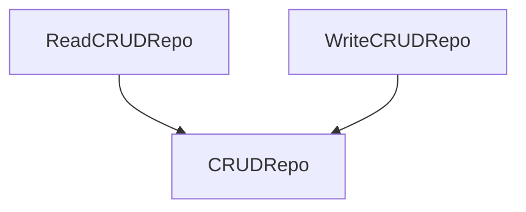

# Repos

Repositories in this library are unified interfaces to work with different types of standard repos:

* CRUD (create/read/update/delete)
* Key-value
* Key-value**s**

## CRUD

Default interface for any `CRUD`-oriented realization of repositories. This type of repos separated to three interfaces:

* [ReadCRUDRepo](https://microutils.inmo.dev/micro_utils.dokka/dev.inmo.micro_utils.repos/-read-c-r-u-d-repo/index.html)
* [WriteCRUDRepo](https://microutils.inmo.dev/micro_utils.dokka/dev.inmo.micro_utils.repos/-write-c-r-u-d-repo/index.html)
* [CRUDRepo](https://microutils.inmo.dev/micro_utils.dokka/dev.inmo.micro_utils.repos/-c-r-u-d-repo/index.html)

`CRUDRepo` extends both `ReadCRUDRepo` and `WriteCRUDRepo`.

CRUD repos __do not__ support forced placing of data by id when data is not in repo. That means, that you can't set data in repo by id
which absent in the repository.

### `ReadCRUDRepo`

Contains read-only operations, such as [getById](https://microutils.inmo.dev/micro_utils.dokka/dev.inmo.micro_utils.repos/-read-c-r-u-d-repo/get-by-id.html),
[contains](https://microutils.inmo.dev/micro_utils.dokka/dev.inmo.micro_utils.repos/-read-c-r-u-d-repo/contains.html). This interface can't be observed because of it does not suppose
any mutable operation.

### `WriteCRUDRepo`

Contains write-only operations, such as [create](https://microutils.inmo.dev/micro_utils.dokka/dev.inmo.micro_utils.repos/-write-c-r-u-d-repo/create.html),
[update](https://microutils.inmo.dev/micro_utils.dokka/dev.inmo.micro_utils.repos/-write-c-r-u-d-repo/update.html). This interface can be observed via its flows:

* [newObjectsFlow](https://microutils.inmo.dev/micro_utils.dokka/dev.inmo.micro_utils.repos/-write-c-r-u-d-repo/new-objects-flow.html) for newely
[create](https://microutils.inmo.dev/micro_utils.dokka/dev.inmo.micro_utils.repos/-write-c-r-u-d-repo/create.html)d objects
* [updatedObjectsFlow](https://microutils.inmo.dev/micro_utils.dokka/dev.inmo.micro_utils.repos/-write-c-r-u-d-repo/updated-objects-flow.html) for old
[update](https://microutils.inmo.dev/micro_utils.dokka/dev.inmo.micro_utils.repos/-write-c-r-u-d-repo/update.html)d objects
* [deletedObjectsIdsFlow](https://microutils.inmo.dev/micro_utils.dokka/dev.inmo.micro_utils.repos/-write-c-r-u-d-repo/deleted-objects-ids-flow.html) for
[delete](https://microutils.inmo.dev/micro_utils.dokka/dev.inmo.micro_utils.repos/-write-c-r-u-d-repo/delete-by-id.html)d objects

> INFO:
> 
> By default, all mutating operations consumes `List`s of data (`List<New>` for `create`, `List<Pair<Id, New>>` for `update` and `List<Id>` for delete),
> but all they have their extension function-variations with one/two args (like `create` with `New` arg)

`create` operation consumes list of `New` variants of object and produces `Registered`s list. In most cases, `Registered` variant of object should have
`Id` of registered object, but it is not required for repo.

`update` operation consumes list of pairs with `Id` and `New` objects and produces list of `Registered` objects.

`deleteById` operation consumes list of `Id`s and do not consume anything except of notifying via `deletedObjectsIdsFlow`.
