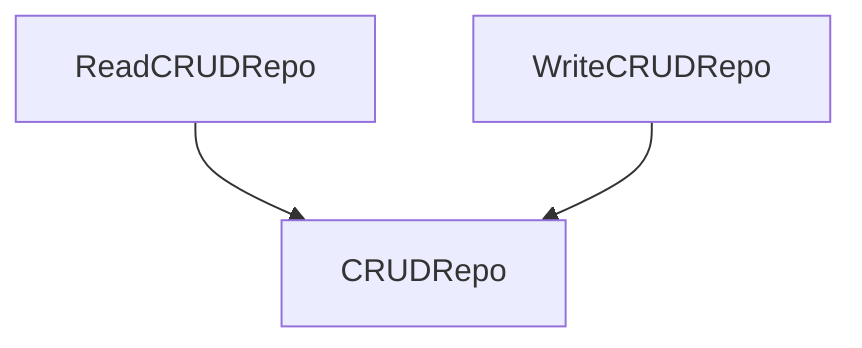

# Repos

Repositories in this library are unified interfaces to work with different types of standard repos:

* CRUD (create/read/update/delete)
* Key-value
* Key-value**s**

## CRUD

Default interface for any `CRUD`-oriented realization of repositories. This type of repos separated to three interfaces:

* [ReadCRUDRepo](https://microutils.inmo.dev/micro_utils.dokka/dev.inmo.micro_utils.repos/-read-c-r-u-d-repo/index.html)
* [WriteCRUDRepo](https://microutils.inmo.dev/micro_utils.dokka/dev.inmo.micro_utils.repos/-write-c-r-u-d-repo/index.html)
* [CRUDRepo](https://microutils.inmo.dev/micro_utils.dokka/dev.inmo.micro_utils.repos/-c-r-u-d-repo/index.html)

`CRUDRepo` extends both `ReadCRUDRepo` and `WriteCRUDRepo`.

CRUD repos __do not__ support forced placing of data by id when data is not in repo. That means, that you can't set data in repo by id
which absent in the repository.

### `ReadCRUDRepo`

Contains read-only operations, such as [getById](https://microutils.inmo.dev/micro_utils.dokka/dev.inmo.micro_utils.repos/-read-c-r-u-d-repo/get-by-id.html),
[contains](https://microutils.inmo.dev/micro_utils.dokka/dev.inmo.micro_utils.repos/-read-c-r-u-d-repo/contains.html). This interface can't be observed because of it does not suppose
any mutable operation.

### `WriteCRUDRepo`

Contains write-only operations, such as [create](https://microutils.inmo.dev/micro_utils.dokka/dev.inmo.micro_utils.repos/-write-c-r-u-d-repo/create.html),
[update](https://microutils.inmo.dev/micro_utils.dokka/dev.inmo.micro_utils.repos/-write-c-r-u-d-repo/update.html). This interface can be observed via its flows:

* [newObjectsFlow](https://microutils.inmo.dev/micro_utils.dokka/dev.inmo.micro_utils.repos/-write-c-r-u-d-repo/new-objects-flow.html) for newely
[create](https://microutils.inmo.dev/micro_utils.dokka/dev.inmo.micro_utils.repos/-write-c-r-u-d-repo/create.html)d objects
* [updatedObjectsFlow](https://microutils.inmo.dev/micro_utils.dokka/dev.inmo.micro_utils.repos/-write-c-r-u-d-repo/updated-objects-flow.html) for old
[update](https://microutils.inmo.dev/micro_utils.dokka/dev.inmo.micro_utils.repos/-write-c-r-u-d-repo/update.html)d objects
* [deletedObjectsIdsFlow](https://microutils.inmo.dev/micro_utils.dokka/dev.inmo.micro_utils.repos/-write-c-r-u-d-repo/deleted-objects-ids-flow.html) for
[delete](https://microutils.inmo.dev/micro_utils.dokka/dev.inmo.micro_utils.repos/-write-c-r-u-d-repo/delete-by-id.html)d objects

> INFO:
> 
> By default, all mutating operations consumes `List`s of data (`List<New>` for `create`, `List<Pair<Id, New>>` for `update` and `List<Id>` for delete),
> but all they have their extension function-variations with one/two args (like `create` with `New` arg)

`create` operation consumes list of `New` variants of object and produces `Registered`s list. In most cases, `Registered` variant of object should have
`Id` of registered object, but it is not required for repo.

`update` operation consumes list of pairs with `Id` and `New` objects and produces list of `Registered` objects.

`deleteById` operation consumes list of `Id`s and do not consume anything except of notifying via `deletedObjectsIdsFlow`.

## KeyValue

Key-value repos has been created to support work with classic key-value stores, where keys are unique across all the repo when values are not unique.
As well as all the others types of repos, this one have two basic types:
[ReadKeyValueRepo](https://microutils.inmo.dev/micro_utils.dokka/dev.inmo.micro_utils.repos/-read-key-value-repo/index.html) and
[WriteKeyValueRepo](https://microutils.inmo.dev/micro_utils.dokka/dev.inmo.micro_utils.repos/-write-key-value-repo/index.html)

### ReadKeyValueRepo

Read repo provides functions like: [contains](https://microutils.inmo.dev/micro_utils.dokka/dev.inmo.micro_utils.repos/-read-key-value-repo/contains.html),
[get](https://microutils.inmo.dev/micro_utils.dokka/dev.inmo.micro_utils.repos/-read-key-value-repo/get.html) or
[values](https://microutils.inmo.dev/micro_utils.dokka/dev.inmo.micro_utils.repos/-read-key-value-repo/values.html).

### WritekeyValueRepo

Contains write-only operations. This interface can be observed via its flows:

* [onNewValue](https://microutils.inmo.dev/micro_utils.dokka/dev.inmo.micro_utils.repos/-write-key-value-repo/on-new-value.html) to retrieve newely set values and keys
* [onValueRemoved](https://microutils.inmo.dev/micro_utils.dokka/dev.inmo.micro_utils.repos/-write-key-value-repo/on-value-removed.html) for the values removed from repo

> INFO:
>
> By default, all mutating operations consumes some collections. For example, [set](https://microutils.inmo.dev/micro_utils.dokka/dev.inmo.micro_utils.repos/-write-key-value-repo/set.html)
> require `Map` with `Key`s and `Value`s and do not returns anything. Instead, it will throw notification via `onNewValue` flow
>
> All the methods on `WriteKeyValueRepo` have their variances with `pairs` (for set) or plain `vararg`s.

`set` operation consumes map of `Key`s and their `Value`s, set them and produces updates via `onNewValue`

`unset` operation consumes list of `Key`s, removing `Value` by `Key` and produces updates via `onValueRemoved`

`unsetWithValues` consumes list of `Value`s, removing all `Key`s with the `Value`s equal to one of the input `Value`s, and then produces updates via `onValueRemoved`
