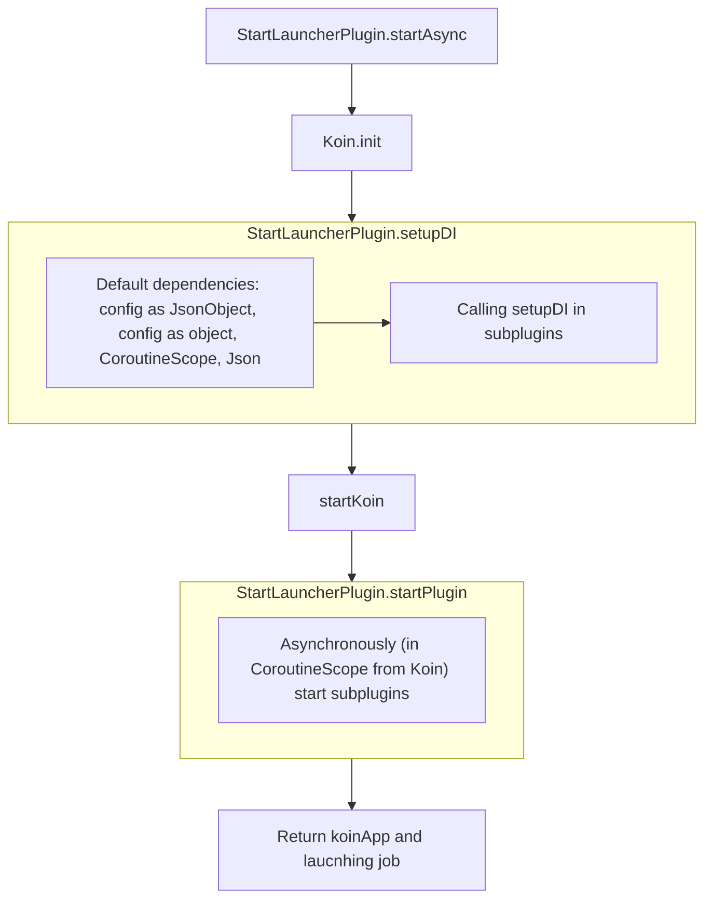

# Startup

[](https://github.com/InsanusMokrassar/MicroUtils)

* **Plugins Package**: `dev.inmo:micro_utils.startup.plugin`
* **Launcher Package**: `dev.inmo:micro_utils.startup.launcher`

This package contains unified simple `Plugin`/`Launcher` tools for separating of your apps parts

Launching logic:




## Plugin

To define plugin, you must use `StartPlugin` as supertype for your plugin. Restrictions are simple: plugins must be an `object` or `class` with empty constructor. Basic sample is here:

```kotlin
object YourPlugin : StartPlugin {
    // Body of your plugin
}
```

Each plugin may contains to parts:

* `setupDI` function to set up DI part
* `startPlugin` function to start plugin

```kotlin
object YourPlugin : StartPlugin {
    override fun Module.setupDI(config: JsonObject) {
        // here you may setup any DI content you wish to be available in context of current Koin module
    }
    override fun startPlugin(koin: Koin) {
        // all staff from setupDI and the same function of other plugins is available in koin
    }
}
```

## Launcher

Basically, launcher module can be used to start application directly from `gradle`. Let's imagine you have this gradle groovy config:

```groovy
plugins {
    id 'org.jetbrains.kotlin.jvm'
    id "org.jetbrains.kotlin.plugin.serialization"
    id 'application'
}

dependencies {
    // kotlin and other dependencies
    implementation ("dev.inmo:micro_utils.startup.launcher:$latest_version")
}

application {
    mainClassName = 'dev.inmo.micro_utils.startup.launcher.MainKt'
}
```

You will be able to run your project with gradle command `./gradlew run --args="path/to/config.json"`. `config.json` must contains something like:

```json
{
    "plugins": [
        "dev.inmo.micro_utils.startup.launcher.HelloWorldPlugin"
    ]
}
```

In current case you will see in logger different logs about launching including log from `HelloWorldPlugin` with text `Hello world`.
