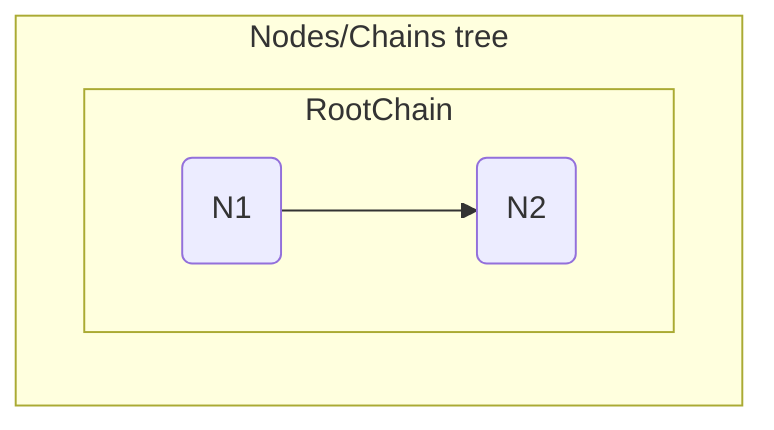
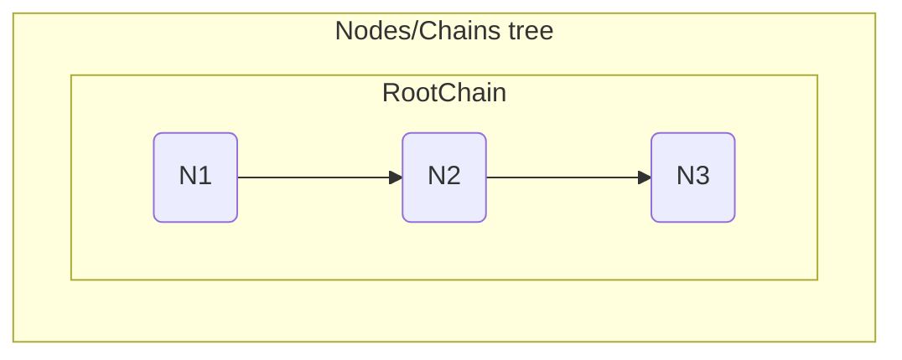
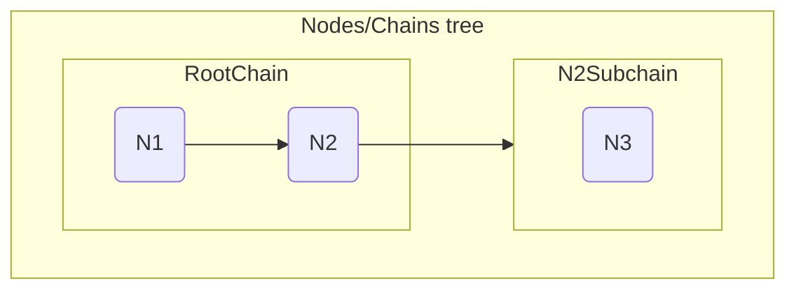
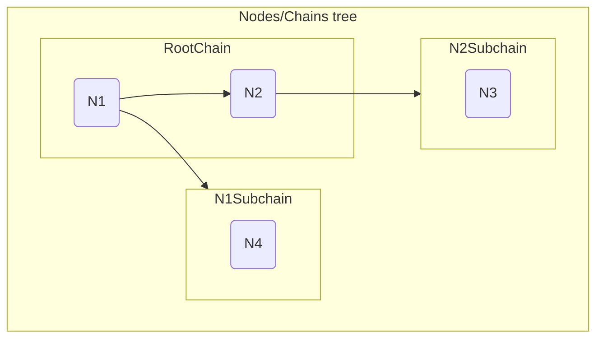
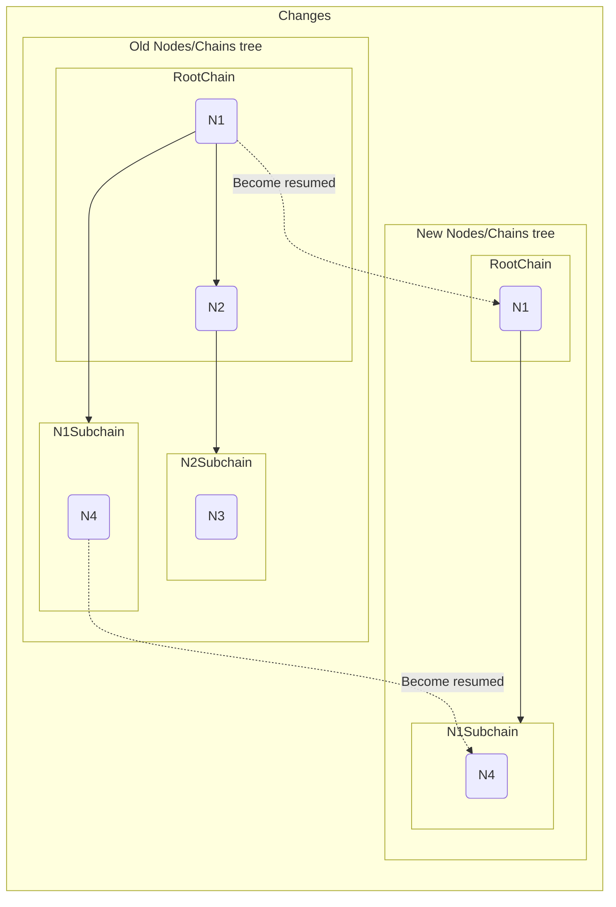
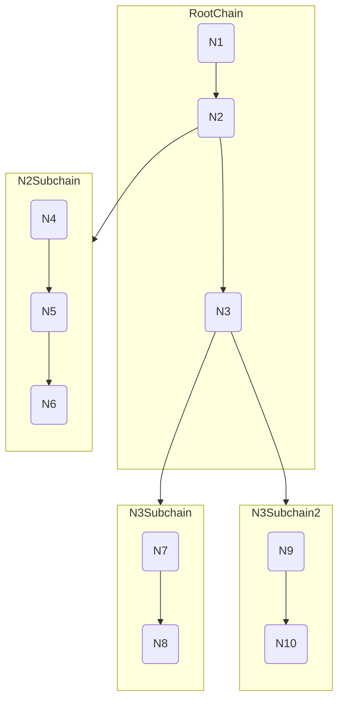

# Navigation

Navigation is a library for simple management for your app views (or some other logics). In this library there are several
important terms:

* `Node` - is a core thing. Node itself contains current config and its state
* `Chain` - some sequence of nodes. In one chain **only the last one** node can be active

## Work explanation

* Only the last (most deep) `node` can be `RESUMED`
* All the `chain`s of resumed `node` will have status `RESUMED`
* Only in the `chain` with status `RESUMED` there are `RESUMED` nodes

??? info Statuses
    There are 3 statuses:
    
    * New - Means that Node/Chain is just created (even before constructor) or has been fully destroyed (in context of navigation)
    * Created - Means that Node/Chain is created or preparing for destroing
    * Started - Means that Node/Chain is hidden and can be resumed/stopped at any time
    * Resumed - Means that Node/Chain now active

    In fact node will retrieve 6 changes of statuses:

    ```mermaid
    flowchart TB
        New -.-> Create
        Create -.-> Created
        Created -.-> Start -.-> Started
        Started --> Resume --> Resumed
        Resumed --> Pause --> Started
        Started --> Stop --> Created
        Created --> Destroy
        Destroy --> New

        DashedLineLegendTitle(Dashed line) -.-> DashedLineLegend(Possible direction before `Created` state)
        SolidLineLegendTitle(Solid line) --> SolidLineLegend(Possible direction after `Created` state)

        class New navigation-new;
        class Destroyed navigation-new;
        class Created navigation-created;
        class Started navigation-started;
        class Resumed navigation-resumed;
    ```
---

### Nodes behaviour

Let's see the next sample:



we may say several things about the sample above:

* N2 is the latest node and it is `RESUMED`
* N1 `PAUSED`
* RootChain is `RESUMED`

So, we would like to add new node in the end of stack:



As we can see, N3 became `RESUMED` and N2 `PAUSED`. Let's try to remove N3:


### Chains behaviour

So, let's continue with the sample above. Let's imagine, we need to add new subchain for N2 node.
Whole tree will look like:



Here has been created new N2Subchain with N3 node. Both them resumed because of:

* N2 is resumed. So, N2Subchain supposed to be resumed
* Due to N2Subhain is resumed and N3 is the latest node, it will be resumed too

We may add new subchain to N1:



So, it has been added, but:

* Due to N1 paused state, N1Subchain have inherited it
* Due to N1Subhain is paused, all its nodes paused too

And now we may remove N2 node. This action will trigger next changes:



What has happened:

1. We solved to remove N2 node. Status is changing to stopped
   1. N2Subchain must be stopped
   2. N3 must be stopped as well

!!! tip "Stopping in context of navigation means destroying"

### Large tree sample


