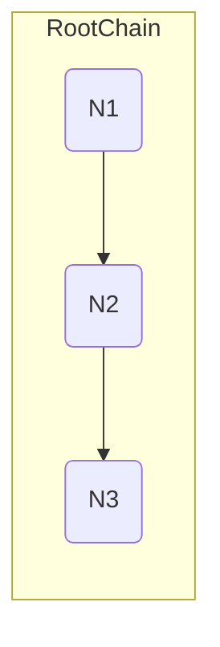

# Navigation

Navigation is a library for simple management for your app views (or some other logics). In this library there are several
important terms:

* `Node` - is a core thing. Node itself contains current config and its state
* `Chain` - some sequence of nodes. In one chain **only the last one** node can be active

## Nodes tree

Let's see the next sample:

Any hierarchy starts with some root chain.
