# PlaguBot

[PlaguBot](https://github.com/InsanusMokrassar/PlaguBot) is a small framework for unifying developing of modules of bots. It is built with two parts:

* [Plugin](https://github.com/InsanusMokrassar/PlaguBot/blob/master/plugin/src/main/kotlin/dev/inmo/plagubot/Plugin.kt)
* [Bot](https://github.com/InsanusMokrassar/PlaguBot/tree/master/bot/src/main/kotlin/dev/inmo/plagubot)

## Plugin

Plugin is a partially independent part of bot. Plugin have several parts:

* `setupDI` - this method should be used to configure DI part of module
* `setupBotPlugin` - method to start/configure your bot actions

Plugin realization should be an `object` or `class` with empty constructor.

## Bot

Most important of bot is `main` function (full reference: `dev.inmo.plagubot.AppKt`). It consumes one argument - path to config.

Bot is initializing with the next algorithm:

```mermaid
flowchart TB
    main["Main"]
    Join["Endless join bot work"]

    subgraph ConfigReading
        direction LR
        ConfigJsonParsing["Parsing to Json"]
        ConfigParsing["Parsing to global config"]
        ConfigJsonParsing --> ConfigParsing
    end
    ConfigReading["Reading of config"]
    
    BotConstructorCalling["Calling of PlaguBot constructor"]

    subgraph BotStart
        direction TB
        BotStartKoinAppInit["Initialization of koin app"]
        
        subgraph BotStartSetupDI
            direction LR
            subgraph BotStartSetupDIPutDefaults["Put defaults in DI"]
                direction LR
                BotStartSetupDIPutDefaultsConfig["Config"]
                BotStartSetupDIPutDefaultsPluginsList["Plugins list"]
                BotStartSetupDIPutDefaultsDatabaseConfig["Database Config"]
                BotStartSetupDIPutDefaultsDefaultJson["Default Json"]
                BotStartSetupDIPutDefaultsPlagubot["PlaguBot itself"]
                BotStartSetupDIPutDefaultsTelegramBot["TelegramBot"]
            end
            BotStartSetupDIIncludes["`Synchronous (in queue) registration of all plugins __setupDI__ modules`"]

            BotStartSetupDIPutDefaults --> BotStartSetupDIIncludes
        end
        BotStartKoinAppStart["`Starting of koin application. Since this step all modules from __setupDI__ of plugins will be available`"]
        
        subgraph BotStartBehaviourContextInitialization["Initialization of behaviour context"]
            direction TB
            BotStartBehaviourContextInitializationStatesManager["`Get from DI or create default **DefaultStatesManagerRepo**`"]
            BotStartBehaviourContextInitializationStatesManagerRepo["`Get from DI or create default **StatesManagerRepo**`"]
            BotStartBehaviourContextInitializationStatesManagerUsedCondition{"Is the default one used?"}
            BotStartBehaviourContextInitializationOnStartConflictsResolver["Getting of all OnStartContextsConflictResolver"]
            BotStartBehaviourContextInitializationOnUpdateConflictsResolver["Getting of all OnUpdateContextsConflictResolver"]
            BotStartBehaviourContextInitializationStateHandlingErrorHandler["`Get from DI or create default **StateHandlingErrorHandler**`"]

            subgraph BotStartBehaviourContextInitializationSetupPlugins["Plugins bot functionality init"]
                BotStartBehaviourContextInitializationSetupPluginsSetupBotPlugin["`Call **setupBotPlugin** for each plugin`"]
            end

            BotStartBehaviourContextInitializationStatesManager --> BotStartBehaviourContextInitializationStatesManagerUsedCondition
            BotStartBehaviourContextInitializationStatesManagerUsedCondition --"Yes"--> BotStartBehaviourContextInitializationStatesManagerRepo
            BotStartBehaviourContextInitializationStatesManagerUsedCondition --"No"--> BotStartBehaviourContextInitializationStateHandlingErrorHandler
            BotStartBehaviourContextInitializationStatesManagerRepo --> BotStartBehaviourContextInitializationOnStartConflictsResolver
            BotStartBehaviourContextInitializationOnStartConflictsResolver --> BotStartBehaviourContextInitializationOnUpdateConflictsResolver
            BotStartBehaviourContextInitializationOnUpdateConflictsResolver --> BotStartBehaviourContextInitializationStateHandlingErrorHandler
            BotStartBehaviourContextInitializationStateHandlingErrorHandler --> BotStartBehaviourContextInitializationSetupPlugins
        end
        BotStartDeleteWebhook["Delete webhooks"]
        BotStartStartLongPolling["Start long polling"]
        
        
        BotStartKoinAppInit --> BotStartSetupDI
        BotStartSetupDI --> BotStartKoinAppStart
        BotStartKoinAppStart --> BotStartBehaviourContextInitialization
        BotStartBehaviourContextInitialization --> BotStartDeleteWebhook
        BotStartDeleteWebhook --> BotStartStartLongPolling
    end
    
    main --> ConfigReading
    ConfigReading --> BotConstructorCalling
    BotConstructorCalling --> BotStart
    BotStart --> Join
```

