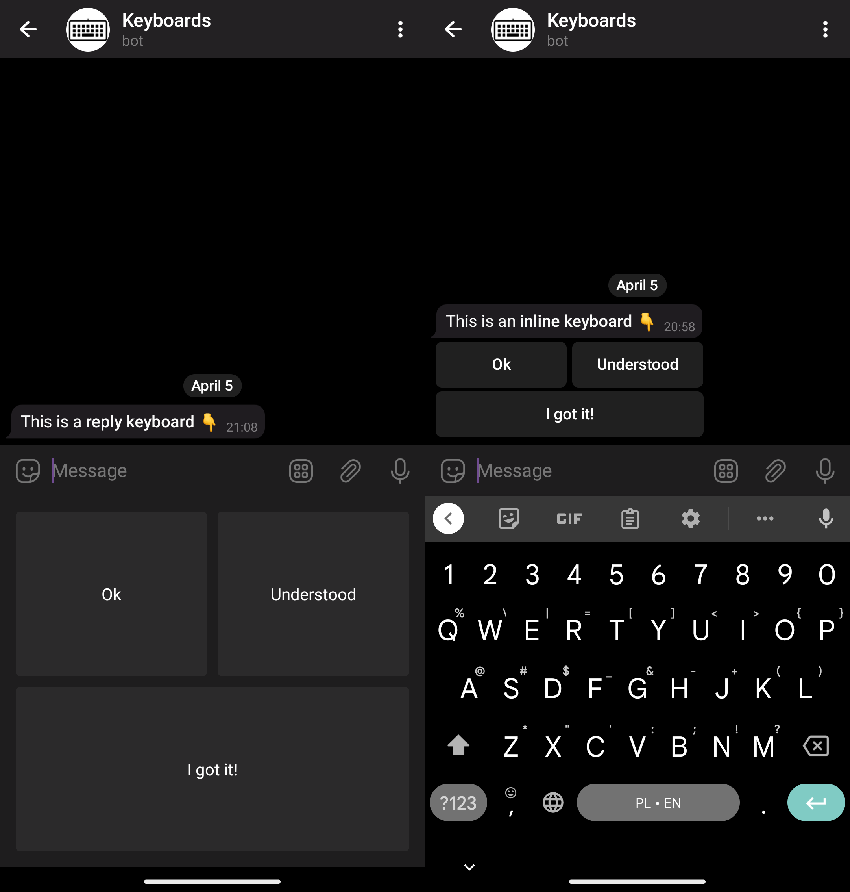
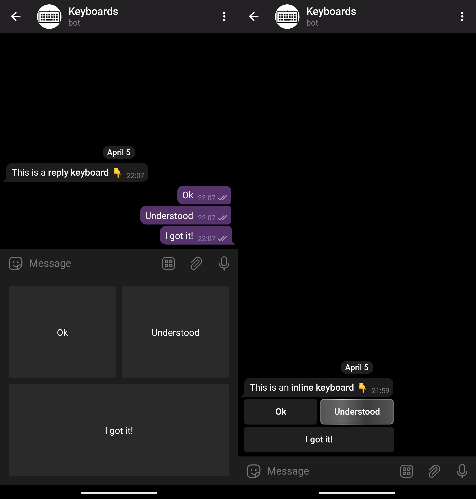
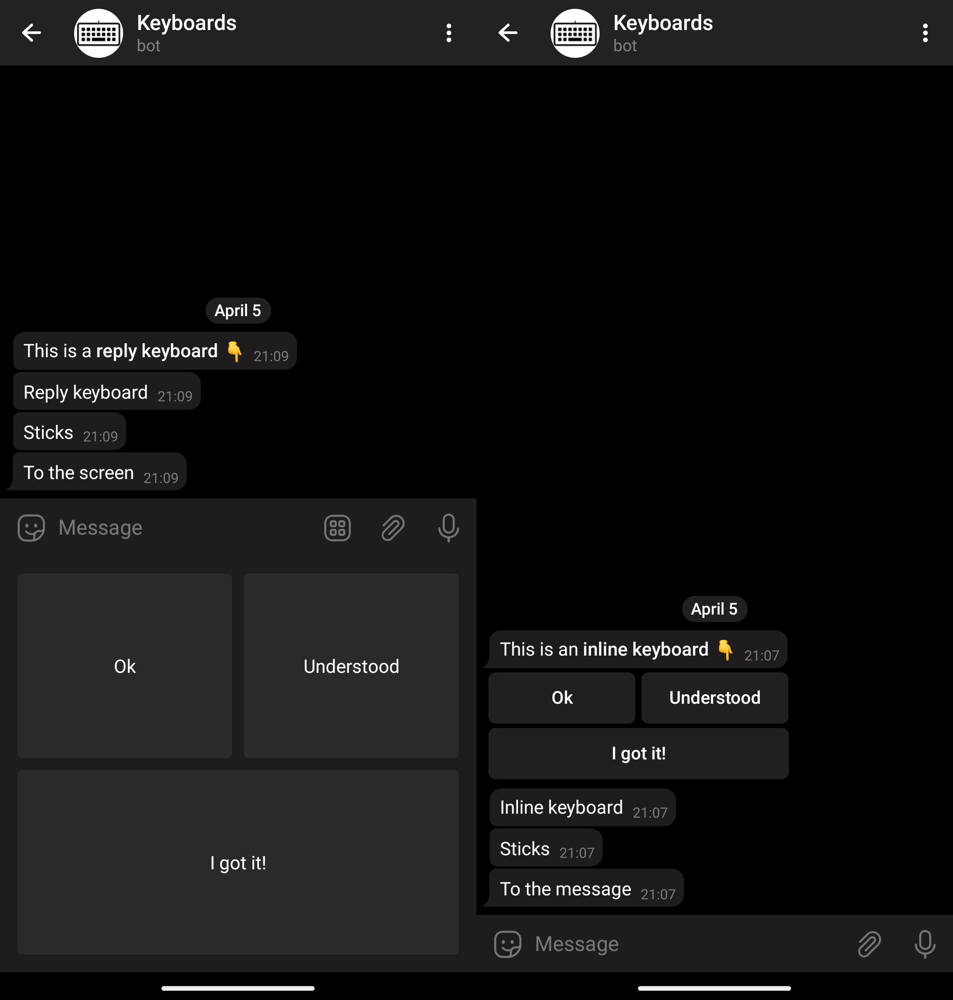
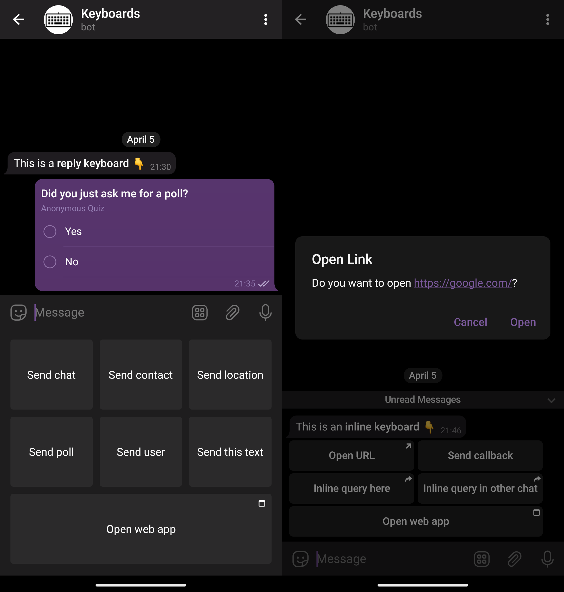
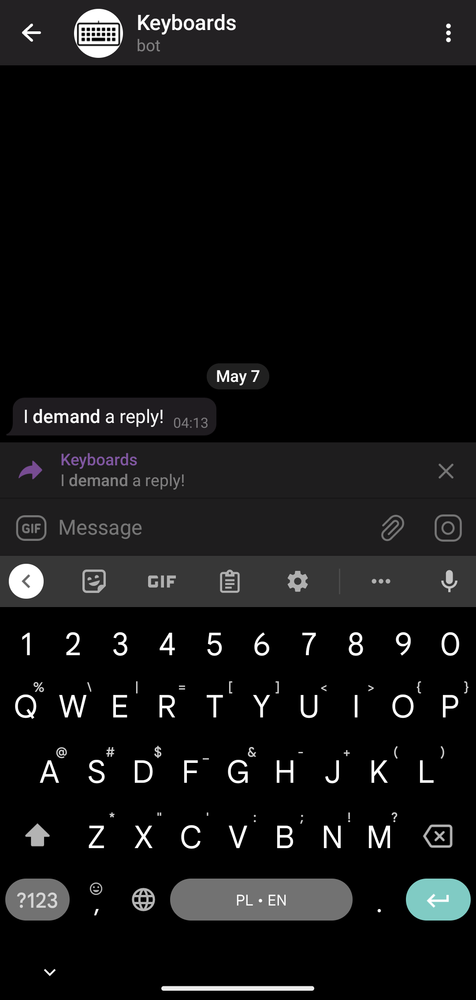
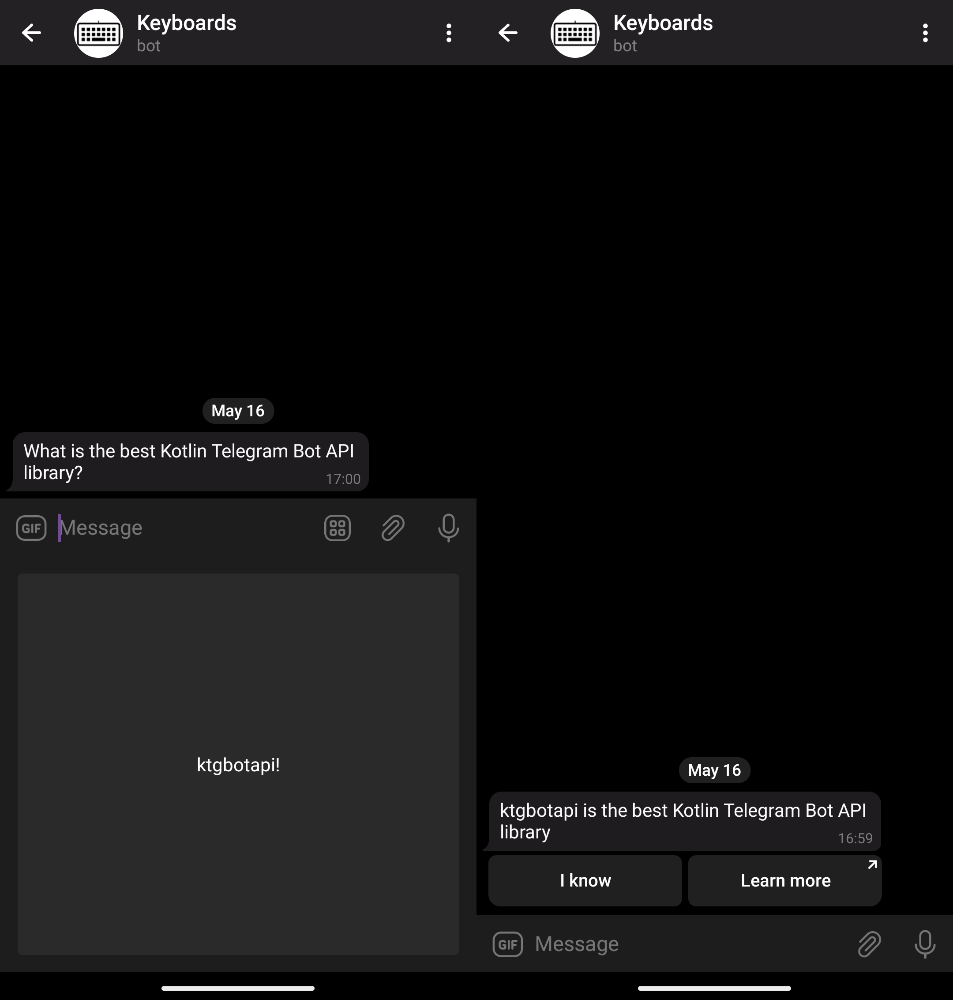
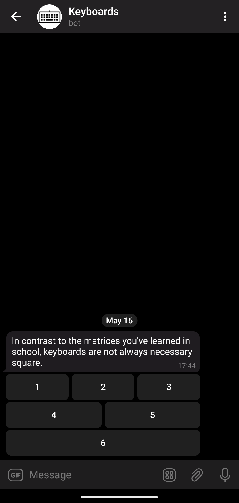

# Keyboards Guide

This guide will help you choose the right keyboard for your needs and show you various API facilities available in the library to support your choice.

## Introduction

### Keyboard Types

The first thing you need to know is that there are two types of keyboards available in the Telegram Bot API: [**reply**](https://core.telegram.org/bots/features#keyboards) and [**inline**](https://core.telegram.org/bots/features#inline-keyboards) keyboards.



> NOTE: **Resize option**
> In the screenshots above (and in the most others) you may see usage of reply keyboards without `resize_keyboard`. In case you will use `resize_keyboard = true` the keyboard will be smaller.

Note the differences in the way these keyboards are shown to a user.

A reply keyboard is shown under the message input field.
It replaces the device's native input method on a mobile device.

An inline keyboard is shown as a part of the message in the chat.

### Simple Keyboard Interactions

When a user clicks on a simple reply keyboard button, its text is just sent in the chat.

When a user clicks on a simple inline keyboard button, nothing is sent to the chat.
Instead, a [callback query](https://core.telegram.org/bots/api#callbackquery) (a fancy way to say "a request") is sent directly to the bot and the button is highlighted.
It will stay highlighted until the bot acks the callback.



> NOTE: **It's a common mistake to forget to handle callback queries**
> It leads to the buttons being highlighted for long periods of time, which leads to a bad user experience.
> Don't forget to handle these callbacks!

As new messages arrive, a reply keyboard will stay there, while the inline keyboard will stick to the message and move with it.



Ups…
The reply keyboard is now far away from the message it was sent with.

Actually, they are two different unrelated entities now: the original message and the reply keyboard.
A reply keyboard persists until you explicitly [remove](https://core.telegram.org/bots/api#replykeyboardremove) it or replace it with a different one.

> NOTE: **It's a common mistake to forget to remove or replace reply keyboards**
> It leads to the keyboards being shown forever. Don't forget to remove reply keyboards when you don't need them anymore!
>
> You also may use option `one_time_keyboard` and the keyboard will be automatically removed after user interaction

An inline keyboard could also be removed or changed by editing the original message it was attached to.

### Extended Keyboard Interactions

Keyboards are not limited to text only.
They could be used to ask users for different things, like payments, locations, phone numbers, etc.
They could be used to open arbitrary URLs or [web apps](https://core.telegram.org/bots/webapps).
Telegram clients process these buttons and interact with the users in the appropriate ways.

For the full list of options, see the official documentation on [reply](https://core.telegram.org/bots/api#keyboardbutton) and [inline](https://core.telegram.org/bots/api#inlinekeyboardbutton) keyboards.



## Basic API & Classes

Now, that you know the basics, let's see how to use the library.

### Keyboards

In Telegram Bot API keyboards are sent to the user as a part of an interaction via the `reply_markup` parameter.
More specifically, this parameter is available:

* in the `sendXXX` methods, like [`sendMessage`](https://core.telegram.org/bots/api#sendmessage), [`sendPhoto`](https://core.telegram.org/bots/api#sendphoto), [`sendSticker`](sendSticker), etc.
* in the [`copyMessage`](https://core.telegram.org/bots/api#copymessage) method
* in the `editMessageXXX` methods, like [`editMessageText`](https://core.telegram.org/bots/api#editmessagetext), [`editMessageCaption`](https://core.telegram.org/bots/api#editmessagecaption), [`editMessageReplyMarkup`](https://core.telegram.org/bots/api#editmessagereplymarkup), etc.
This also includes `stopXXX` methods like the [`stopMessageLiveLocation`](https://core.telegram.org/bots/api#stopmessagelivelocation) method.

> TIP: `editMessageReplyMarkup` is specifically designed to edit a message's inline keyboard.

Sending inline keyboards is also supported in inline mode through the `reply_markup` parameter of the [`InlineQueryResult`](https://core.telegram.org/bots/api#inlinequeryresult) type and its inheritors.
However, this [inline mode](https://core.telegram.org/bots/inline) is unrelated to the inline keyboards.

The `reply_markup` parameter accepts four different types.
Two of them — [`ReplyKeyboardMarkup`](https://core.telegram.org/bots/api#replykeyboardmarkup) and [`InlineKeyboardMarkup`](https://core.telegram.org/bots/api#inlinekeyboardmarkup) — correspond to the reply and inline keyboards respectively.
The [`ReplyKeyboardRemove`](https://core.telegram.org/bots/api#replykeyboardremove) type is used to remove reply keyboards, but it's not a keyboard itself.
The last one, [`ForceReply`](https://core.telegram.org/bots/api#forcereply), is used to force users to reply to the bot.
It is not a keyboard either, but yet another dirty hack employed by the Telegram Bot API.



Now, in the library, the [`WithReplyMarkup`](https://tgbotapi.inmo.dev/tgbotapi.core/dev.inmo.tgbotapi.abstracts.types/-with-reply-markup/index.html) is a [marker interface](https://en.wikipedia.org/wiki/Marker_interface_pattern) for all the interactions which could have a `replyMarkup` (represents `reply_markup`) parameter.
It is extended by the [`ReplyingMarkupSendMessageRequest`](https://tgbotapi.inmo.dev/tgbotapi.core/dev.inmo.tgbotapi.requests.send.abstracts/-replying-markup-send-message-request/index.html), and then, finally, by classes like [`SendTextMessage`](https://tgbotapi.inmo.dev/tgbotapi.core/dev.inmo.tgbotapi.requests.send/-send-text-message/index.html).
This, basically, corresponds to the Telegram Bot API.

> NOTE: You may see all the inheritors of `WithReplyMarkup` interfaces in the corresponding [KDoc](https://tgbotapi.inmo.dev/tgbotapi.core/dev.inmo.tgbotapi.abstracts.types/-with-reply-markup/index.html)

The other way to send a keyboard is through the `replyMarkup` parameter of the numerous extension methods, like [`sendMessage`](https://tgbotapi.inmo.dev/tgbotapi.api/dev.inmo.tgbotapi.extensions.api.send/send-message.html).
Those are just convenient wrappers around general interaction classes, like the aforementioned `SendTextMessage`.

### Buttons

As we already know, keyboards consist of buttons.
Button classes reside in the `dev.inmo.tgbotapi.types.buttons` package.

The base class for the reply keyboard buttons is the [`KeyboardButton`](https://tgbotapi.inmo.dev/tgbotapi.core/dev.inmo.tgbotapi.types.buttons/-keyboard-button/index.html).
The base class for the inline keyboard buttons is the [`InlineKeyboardButton`](https://tgbotapi.inmo.dev/tgbotapi.core/dev.inmo.tgbotapi.types.buttons.InlineKeyboardButtons/-inline-keyboard-button/index.html).

See their inheritors for the full list of the available buttons.
The names are pretty self-explanatory and correspond to the Telegram Bot API.

For example, to send a simple reply keyboard button, use the [`SimpleKeyboardButton`](https://tgbotapi.inmo.dev/tgbotapi.core/dev.inmo.tgbotapi.types.buttons/-simple-keyboard-button/index.html) class.
To request a contact from the user through the reply, use the [`RequestContactKeyboardButton`](https://tgbotapi.inmo.dev/tgbotapi.core/dev.inmo.tgbotapi.types.buttons/-request-contact-keyboard-button/index.html) class.
To attach a URL button to the message, use the [`URLInlineKeyboardButton`](https://tgbotapi.inmo.dev/tgbotapi.core/dev.inmo.tgbotapi.types.buttons.InlineKeyboardButtons/-u-r-l-inline-keyboard-button/index.html).
And to attach a callback button, use the [`CallbackDataInlineKeyboardButton`](https://tgbotapi.inmo.dev/tgbotapi.core/dev.inmo.tgbotapi.types.buttons.InlineKeyboardButtons/-callback-data-inline-keyboard-button/index.html).

You get the idea.

So, to send a reply keyboard use the following code:

```kotlin
bot.sendMessage(
    chatId = chat,
    text = "What is the best Kotlin Telegram Bot API library?",
    replyMarkup = ReplyKeyboardMarkup(
        keyboard = listOf(
            listOf(
                SimpleKeyboardButton("ktgbotapi"),
            ),
        )
    )
)
```

And here is how you send a basic inline keyboard:

```kotlin
bot.sendMessage(
    chatId = chat,
    text = "ktgbotapi is the best Kotlin Telegram Bot API library",
    replyMarkup = InlineKeyboardMarkup(
        keyboard = listOf(
            listOf(
                CallbackDataInlineKeyboardButton("I know", "know"),
                URLInlineKeyboardButton("Learn more", "https://github.com/InsanusMokrassar/ktgbotapi")
            ),
        )
    ),
)
```



When we're done with this simple quiz, we can remove the keyboard with the following code:

```kotlin
bot.sendMessage(
    chatId = chat,
    text = "You're goddamn right!",
    replyMarkup = ReplyKeyboardRemove()
)
```

> NOTE: Don't forget to remove the reply keyboards!

### Matrices

Buttons in keyboards are arranged in matrices, i.e. two-dimensional arrays, or, to say in layperson's terms, rows and columns.
In contrast to the matrices you've learned in school, keyboards are not always necessarily square.
Try it:


```kotlin
bot.sendMessage(
    chatId = chat,
    text = "In contrast to the matrices you've learned in school, keyboards are not always necessary square.",
    replyMarkup = InlineKeyboardMarkup(
        keyboard = listOf(
            listOf(
                CallbackDataInlineKeyboardButton("1", "1"),
                CallbackDataInlineKeyboardButton("2", "2"),
                CallbackDataInlineKeyboardButton("3", "3"),
            ),
            listOf(
                CallbackDataInlineKeyboardButton("4", "4"),
                CallbackDataInlineKeyboardButton("5", "5"),
            ),
            listOf(
                CallbackDataInlineKeyboardButton("6", "6"),
            )
        )
    )
)
```



This way of building matrices is not very convenient, so the library provides a few eloquent DSLs to simplify that.

First, there are [`matrix`](https://tgbotapi.inmo.dev/tgbotapi.core/dev.inmo.tgbotapi.utils/matrix.html) and [`row`](https://tgbotapi.inmo.dev/tgbotapi.core/dev.inmo.tgbotapi.utils/row.html), so the keyboard above can be built like this:

```kotlin
bot.sendMessage(
    chatId = chat,
    text = "DSLs are sweet!",
    replyMarkup = InlineKeyboardMarkup(
        keyboard = matrix {
            row {
                +CallbackDataInlineKeyboardButton("1", "1")
                +CallbackDataInlineKeyboardButton("2", "2")
                +CallbackDataInlineKeyboardButton("3", "3")
            }
            row(
                CallbackDataInlineKeyboardButton("4", "4"),
                CallbackDataInlineKeyboardButton("5", "5"),
            )
            row {
                +CallbackDataInlineKeyboardButton("6", "6")
            }
        },
    )
)
```
> NOTE: Those plus signs are mandatory.

> NOTE: There are two different `row` functions here. Can you spot the difference?

A single-row matrix can be built with a [`flatMatrix`](https://tgbotapi.inmo.dev/tgbotapi.core/dev.inmo.tgbotapi.utils/flat-matrix.html):

```kotlin
flatMatrix {
    +CallbackDataInlineKeyboardButton("1", "1")
    +CallbackDataInlineKeyboardButton("2", "2")
    +CallbackDataInlineKeyboardButton("3", "3")
    +CallbackDataInlineKeyboardButton("4", "4")
    +CallbackDataInlineKeyboardButton("5", "5")
}
```

But the most convenient way to build a simple keyboard is to use the constructor-like methods: [`InlineKeyboardMarkup`](https://tgbotapi.inmo.dev/tgbotapi.utils/dev.inmo.tgbotapi.extensions.utils.types.buttons/-inline-keyboard-markup.html) and [`ReplyKeyboardMarkup`](https://tgbotapi.inmo.dev/tgbotapi.utils/dev.inmo.tgbotapi.extensions.utils.types.buttons/-reply-keyboard-markup.html).
Note, that they are named just like the corresponding constructor, but take a vararg of buttons.
They create flat matrices, i.e. single rows.

### Keyboards DSL

Finally, there are [`inlineKeyboard`](https://tgbotapi.inmo.dev/tgbotapi.utils/dev.inmo.tgbotapi.extensions.utils.types.buttons/inline-keyboard.html) and [`replyKeyboard`](https://tgbotapi.inmo.dev/tgbotapi.utils/dev.inmo.tgbotapi.extensions.utils.types.buttons/reply-keyboard.html)

DSL methods above rely on Kotlin's feature of receivers and extensions.
So, the magic is done by [`MatrixBuilder`](https://tgbotapi.inmo.dev/tgbotapi.core/dev.inmo.tgbotapi.utils/-matrix-builder/index.html) and [`RowBuilder`](https://tgbotapi.inmo.dev/tgbotapi.core/dev.inmo.tgbotapi.utils/-row-builder/index.html).
That's why you must use the plus sign to add buttons to the matrix: it's just an overloaded operator call, another cool Kotlin feature widely used to create sweet DSLs.

Another bonus of using these DSLs is button builders, like [`payButton`](https://tgbotapi.inmo.dev/tgbotapi.utils/dev.inmo.tgbotapi.extensions.utils.types.buttons/pay-button.html), [`dataButton`](https://tgbotapi.inmo.dev/tgbotapi.utils/dev.inmo.tgbotapi.extensions.utils.types.buttons/data-button.html), and [`urlButton`](https://tgbotapi.inmo.dev/tgbotapi.utils/dev.inmo.tgbotapi.extensions.utils.types.buttons/url-button.html):

```kotlin
bot.sendMessage(
    chatId = chat,
    text = "All in one!",
    replyMarkup = InlineKeyboardMarkup(
        keyboard = matrix {
            row {
                payButton("Send money")
                dataButton("Ok", "ok")
                urlButton("Google", "https://google.com")
            }
        },
    )
)
```

Reply keyboard builders provide similar extensions, e.g. 
[`requestLocationButton`](https://tgbotapi.inmo.dev/tgbotapi.utils/dev.inmo.tgbotapi.extensions.utils.types.buttons/request-location-button.html).

So, choose the style you like — from plain Kotlin lists to sweet DSLs — and use it!

## Working with keyboards

Working with keyboards is not something special in Telegram Bot API.
As you have already seen, keyboards are just message parameters.
Similarly, keyboard interactions are represented by regular [Updates](https://core.telegram.org/bots/api#getting-updates).
I.e. when a user interacts with a keyboard, the bot receives an update.

On the other hand, the library is heavily typed, so the actual type of update you would receive varies.

### Reply keyboards

As it was said, reply keyboards cause Telegram clients to send regular messages back to the bot.
Peruse this example:

```kotlin
bot.buildBehaviourWithLongPolling {
    bot.sendMessage(
        chatId = chat,
        text = "👮 Turn in your accomplices or be prepared for a lengthy 🍆 incarceration ⛓ 👊 ‼",
        replyMarkup = replyKeyboard {
            +SimpleKeyboardButton(
                "I ain't no rat! 🚫🐀🤐🙅"
            )
            +RequestUserKeyboardButton(
                "Rat out 🐀 a friend 👤",
                KeyboardButtonRequestUser.Common(RequestId.random())
            )
            +RequestChatKeyboardButton(
                "Rat out 🐀 a group of friends 👥",
                KeyboardButtonRequestChat.Group(RequestId.random())
            )
        }
    )

    onText { message: CommonMessage<TextContent> ->
        assert(message.text == "I ain't no rat! 🚫🐀🤐🙅")
        bot.reply(
            to = message,
            text = "Good, you're going to jail alone! ⛓🧑⛓",
            replyMarkup = ReplyKeyboardRemove()
        )
    }

    onUserShared { message: PrivateEventMessage<UserShared> ->
        bot.reply(
            to = message,
            text = "Haha, you and you friend are both going to jail! ⛓👬⛓",
            replyMarkup = ReplyKeyboardRemove()
        )
    }

    onChatShared { message: PrivateEventMessage<ChatShared> ->
        bot.reply(
            to = message,
            text = "Haha, now you're all going to jail! ⛓👨‍👦‍👦⛓",
            replyMarkup = ReplyKeyboardRemove()
        )
    }
}.join()
```

> NOTE: Read more about `buildBehaviourWithLongPolling` [here](../logic/behaviour-builder.md)

I hope you get the idea: the bot acts like a cop and asks the user to rat out his friends via a reply keyboard (it's an imaginary situation, of course).
The user may refuse to cooperate, rat out a single friend or the whole imaginary group.
The bot receives the user's choices as regular updates, the code above has explicit types (generally optional in Kotlin) and an assert to demonstrate this.

And here is how it works (the user selects the options in the order):

<video src='keyboards/008.mp4' width="100%"></video>
<!--  -->

Note how you handle reply keyboards: you process regular messages.
For instance, a simple text button sends a regular text message indistinguishable from a case when a user simply types the same text manually.

And don't be a rat in real life: remove the keyboards with the `ReplyKeyboardRemove` after you've received the input!
Otherwise, a keyboard will stay there indefinitely.

### Inline keyboards

Finally, to master the keyboards, you need to know how to handle the inline ones.

Again, let's explore the example.
Imagine you're making a quiz where users are given a question and a set of answers.
Additionally, users are given a link to the wiki page to help with the question and a Google button.

The quiz could be implemented this way:

```kotlin
// A simple data class to represent a question
val question = Question(
    image = "https://upload.wikimedia.org/wikipedia/commons/a/a5/Tsunami_by_hokusai_19th_century.jpg",
    question = "Who painted this?",
    answers = listOf(
        Answer("Hokusai", correct = true),
        Answer("Sukenobu"),
        Answer("Chōshun"),
        Answer("Kiyonobu I"),
    ),
    wiki = "https://en.wikipedia.org/wiki/Ukiyo-e",
)

bot.buildBehaviourWithLongPolling {
    bot.sendPhoto(
        chatId = chat,
        fileId = InputFile.fromUrl(question.image),
        text = question.question,
        replyMarkup = inlineKeyboard {
            // First row: answers
            row {
                for (answer in question.answers.shuffled()) {
                    dataButton(
                        text = answer.answer,
                        data = "${answer.answer}:${answer.correct}",
                    )
                }
            }

            // Second row: help buttons
            row {
                urlButton("Wiki 💁", question.wiki)
                webAppButton("Google 🔍", "https://google.com")
            }
        }
    )

    onDataCallbackQuery { callback: DataCallbackQuery ->
        val (answer, correct) = callback.data.split(":")

        if (correct.toBoolean()) {
            bot.answerCallbackQuery(
                callback,
                text = "$answer is a ✅ correct answer!",
                showAlert = true
            )
        } else {
            bot.answerCallbackQuery(
                callback,
                text = "❌ Try again, $answer is not a correct answer…",
                showAlert = true
            )
        }
    }
}.join()
```

A few important things to note here.

First, the data buttons (they have the [`CallbackDataInlineKeyboardButton`](https://tgbotapi.inmo.dev/tgbotapi.core/dev.inmo.tgbotapi.types.buttons.InlineKeyboardButtons/-callback-data-inline-keyboard-button/index.html) type, but in the code we used a [neat DSL](https://tgbotapi.inmo.dev/tgbotapi.utils/dev.inmo.tgbotapi.extensions.utils.types.buttons/data-button.html)) must have unique `data`.
If the `data` is not unique, Telegram clients will highlight all the buttons with the same data when a user clicks on one of them.
Guess how I know that?
Well, it's not in the docs, so trial and error is the only way to learn it (and many other things about the Telegram Bot API).

Second, the way you handle inline keyboards is different from the way you handle reply keyboards.
Bot API will send updates with a `callback_query` field populated.
This field, of a [`CallbackQuery`](https://core.telegram.org/bots/api#callbackquery) type, represents incoming callbacks from callback buttons in inline keyboards.
The library turns them into [multiple callback types](https://tgbotapi.inmo.dev/tgbotapi.core/dev.inmo.tgbotapi.types.queries.callback/index.html), like the [`DataCallbackQuery`](https://tgbotapi.inmo.dev/tgbotapi.core/dev.inmo.tgbotapi.types.queries.callback/-data-callback-query/index.html) we used in the example.
Finally, to handle these callbacks you could use [`onDataCallbackQuery`](https://tgbotapi.inmo.dev/tgbotapi.behaviour_builder/dev.inmo.tgbotapi.extensions.behaviour_builder.triggers_handling/on-data-callback-query.html).
Alternatively, if you're not using any DSLs, you have to handle the [`CallbackQueryUpdate`](https://tgbotapi.inmo.dev/tgbotapi.core/dev.inmo.tgbotapi.types.update/-callback-query-update/index.html) update type.

Third, the buttons got highlighted when a user clicks on them.
When you're done with the callback, you need to answer it, by using the [`answerCallbackQuery`](https://tgbotapi.inmo.dev/tgbotapi.api/dev.inmo.tgbotapi.extensions.api.answers/answer-callback-query.html) function.
Otherwise, the button will remain highlighted.
Telegram clients will eventually remove the highlight, but it's still frustrating.

Finally, you could choose between two styles of acknowledgment: a simple toast-like message or a modal alert.
The `showAlert` flag controls this behavior.

And here is the demo of the quiz:

<video src='keyboards/009.mp4' width="100%"></video>
<!--  -->

## Conclusion

Today we've learned how to use keyboards in Telegram bots.
There are two types of keyboards: reply and inline.
Reply keyboards replace the device's keyboard and make clients send a message with the predefined content.
Inline keyboards are buttons attached to messages.
Clicking on them causes the client to send a callback to the bot.
In both scenarios the bot receives an update of a corresponding type and has to acknowledge the keayboard interaction for the client to work properly.
