# Types conversations

One of the most important topics in context of tgbotapi is types conversations. This library is very strong-typed and a lot of things are based on types hierarchy. Lets look into the hierarchy of classes for the [Message](https://github.com/InsanusMokrassar/TelegramBotAPI/blob/master/tgbotapi.core/src/commonMain/kotlin/dev/inmo/tgbotapi/types/message/abstracts/Message.kt#L12) in 0.35.8:

```mermaid
%%{init: {"flowchart": {"defaultRenderer": "elk"}} }%%
classDiagram
    Message <|-- AccessibleMessage
    AccessibleMessage <|-- ChatEventMessage
    ChatEventMessage <|-- ChannelEventMessage
    ChatEventMessage <|-- GroupEventMessage
    GroupEventMessage <|-- ChannelDirectMessagesEventMessage
    ChannelDirectMessagesEventMessage <|-- CommonChannelDirectMessagesEventMessage
    GroupEventMessage <|-- CommonGroupEventMessage
    GroupEventMessage <|-- SupergroupEventMessage
    SupergroupEventMessage <|-- CommonSupergroupEventMessage
    ChatEventMessage <|-- PrivateEventMessage
    ChatEventMessage <|-- PrivateForumEventMessage
    AccessibleMessage <|-- CommonMessage
    CommonMessage <|-- PossiblySentViaBotCommonMessage
    PossiblySentViaBotCommonMessage <|-- BusinessContentMessage
    BusinessContentMessage <|-- BusinessContentMessageImpl
    PossiblySentViaBotCommonMessage <|-- ChannelContentMessage
    ChannelContentMessage <|-- ChannelContentMessageImpl
    ChannelContentMessage <|-- ChannelPaidPost
    ChannelPaidPost <|-- ChannelPaidPostImpl
    PossiblySentViaBotCommonMessage <|-- PrivateContentMessage
    PrivateContentMessage <|-- PrivateContentMessageImpl
    PrivateContentMessage <|-- PrivateForumContentMessage
    PrivateForumContentMessage <|-- PrivateForumContentMessageImpl
    PossiblySentViaBotCommonMessage <|-- PublicContentMessage
    PublicContentMessage <|-- GroupContentMessage
    GroupContentMessage <|-- AnonymousGroupContentMessage
    AnonymousGroupContentMessage <|-- AnonymousGroupContentMessageImpl
    GroupContentMessage <|-- ChannelDirectMessagesContentMessage
    ChannelDirectMessagesContentMessage <|-- CommonChannelDirectMessagesContentMessage
    CommonChannelDirectMessagesContentMessage <|-- CommonChannelDirectMessagesContentMessageImpl
    ChannelDirectMessagesContentMessage <|-- FromChannelChannelDirectMessagesContentMessage
    FromChannelChannelDirectMessagesContentMessage <|-- FromChannelChannelDirectMessagesContentMessageImpl
    ChannelDirectMessagesContentMessage <|-- SuggestedChannelDirectMessagesContentMessage
    SuggestedChannelDirectMessagesContentMessage <|-- CommonSuggestedChannelDirectMessagesContentMessage
    CommonSuggestedChannelDirectMessagesContentMessage <|-- CommonSuggestedChannelDirectMessagesContentMessageImpl
    SuggestedChannelDirectMessagesContentMessage <|-- FromChannelSuggestedChannelDirectMessagesContentMessage
    FromChannelSuggestedChannelDirectMessagesContentMessage <|-- FromChannelSuggestedChannelDirectMessagesContentMessageImpl
    GroupContentMessage <|-- CommonGroupContentMessage
    CommonGroupContentMessage <|-- CommonGroupContentMessageImpl
    GroupContentMessage <|-- ForumContentMessage
    ForumContentMessage <|-- AnonymousForumContentMessage
    AnonymousForumContentMessage <|-- AnonymousForumContentMessageImpl
    ForumContentMessage <|-- CommonForumContentMessage
    CommonForumContentMessage <|-- CommonForumContentMessageImpl
    ForumContentMessage <|-- FromChannelForumContentMessage
    FromChannelForumContentMessage <|-- FromChannelForumContentMessageImpl
    GroupContentMessage <|-- FromChannelGroupContentMessage
    FromChannelGroupContentMessage <|-- ConnectedFromChannelGroupContentMessage
    ConnectedFromChannelGroupContentMessage <|-- ConnectedFromChannelGroupContentMessageImpl
    FromChannelGroupContentMessage <|-- FromChannelChannelDirectMessagesContentMessage
    FromChannelGroupContentMessage <|-- FromChannelForumContentMessage
    FromChannelGroupContentMessage <|-- FromChannelSuggestedChannelDirectMessagesContentMessage
    FromChannelGroupContentMessage <|-- UnconnectedFromChannelGroupContentMessage
    UnconnectedFromChannelGroupContentMessage <|-- UnconnectedFromChannelGroupContentMessageImpl
    GroupContentMessage <|-- PotentiallyFromUserGroupContentMessage
    PotentiallyFromUserGroupContentMessage <|-- CommonChannelDirectMessagesContentMessage
    PotentiallyFromUserGroupContentMessage <|-- CommonForumContentMessage
    PotentiallyFromUserGroupContentMessage <|-- CommonGroupContentMessage
    PotentiallyFromUserGroupContentMessage <|-- CommonSuggestedChannelDirectMessagesContentMessage
    AccessibleMessage <|-- ContentMessage
    ContentMessage <|-- CommonMessage
    ContentMessage <|-- PossiblyMediaGroupMessage
    PossiblyMediaGroupMessage <|-- CommonMessage
    AccessibleMessage <|-- OptionallyFromUserMessage
    OptionallyFromUserMessage <|-- ChannelContentMessage
    OptionallyFromUserMessage <|-- FromUserMessage
    FromUserMessage <|-- BusinessContentMessage
    FromUserMessage <|-- CommonChannelDirectMessagesContentMessage
    FromUserMessage <|-- CommonForumContentMessage
    FromUserMessage <|-- CommonGroupContentMessage
    FromUserMessage <|-- CommonSuggestedChannelDirectMessagesContentMessage
    FromUserMessage <|-- GroupEventMessage
    FromUserMessage <|-- PassportMessage
    FromUserMessage <|-- PrivateContentMessage
    AccessibleMessage <|-- PassportMessage
    AccessibleMessage <|-- PossiblyEditedMessage
    PossiblyEditedMessage <|-- CommonMessage
    AccessibleMessage <|-- PossiblyForwardedMessage
    PossiblyForwardedMessage <|-- CommonMessage
    AccessibleMessage <|-- PossiblyPaymentMessage
    AccessibleMessage <|-- PossiblyTopicMessage
    PossiblyTopicMessage <|-- ForumContentMessage
    PossiblyTopicMessage <|-- PrivateForumContentMessage
    AccessibleMessage <|-- SignedMessage
    SignedMessage <|-- AnonymousForumContentMessage
    SignedMessage <|-- AnonymousGroupContentMessage
    SignedMessage <|-- ChannelContentMessage
    SignedMessage <|-- FromChannelGroupContentMessage
    AccessibleMessage <|-- UnknownMessageType
    Message <|-- InaccessibleMessage
    Message <|-- PossiblyOfflineMessage
    PossiblyOfflineMessage <|-- CommonMessage
    PossiblyOfflineMessage <|-- PrivateContentMessage
    Message <|-- PossiblyPaidMessage
    PossiblyPaidMessage <|-- CommonMessage
    Message <|-- PossiblyWithEffectMessage
    PossiblyWithEffectMessage <|-- PrivateContentMessage
```



As you may see, it is a little bit complex and require several tools for types conversation.

## As

`as` conversations will return new type in case if it is possible. For example, when you got `Message`, you may use `asContentMessage` conversation to get message with `content`:

```kotlin
val message: Message;
println(message.asContentMessage() ?.content)
```

This code will print `null` in case when `message` is not `ContentMessage`, and `content` when is.

## Require

`require` works like `as`, but instead of returning nullable type, it will always return object with required type OR throw `ClassCastException`:

```kotlin
val message: Message;
println(message.requireContentMessage().content)
```

This code will throw exception when message is not `ContentMessage` and print `content` when is.

## When

`when` extensions will call passed `block` when type is correct. For example:

```kotlin
val message: Message;
message.whenContentMessage {
    println(it.content)
}
```

Code placed above will print `content` when `message` is `ContentMessage` and do nothing when not